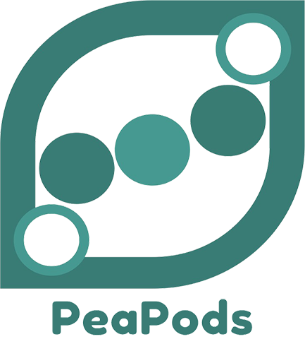
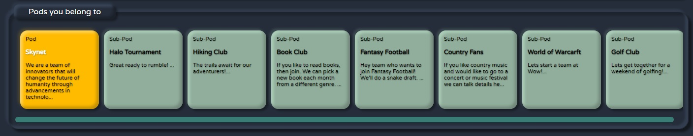
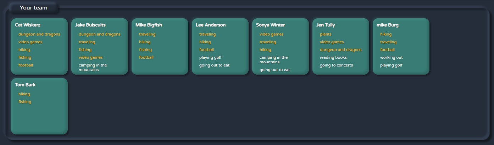

# peapods

## About The Project
**PeaPods**
PeaPods is designed for teams wanting to know more about eachother at a quick glance.
- Create a Pod for your company.
- Invite your team members.
- Everyone adds hobbies/interests to their profile.
- Connect with other team members based on common hobbies/interests.

### How to get started with PeaPods
1. Download the zip file and extract the contents.
2. Using terminal go to the location of the file and open it
3. Create a virtual environment 
  - `python -m venv venv`
4. Activate the virtual environment to containarize installation of required python packages
  - `venv\scripts\activate`
  - you'll know that venv has been activated when you see (venv) infront of your directory path
5. Install required python packages for the poject that are listed in requirements.txt file
  - `pip install -r requirements.txt`
6. Run PeaPods in the terminal window
  - `python app.py`
  
Some functionality will not work because of environment variables that are not included with the files.
- open weather map API
- Trip Advisor API
- Sending email credentials.

## Features:
- Create, Update, Delete user account
- Each user can create only one pod for team, company, organization. If they are already part of the pod, then they can not create a new pod until they leave the current pod.
- Owner of the pod can invite members to the pod.
- Members will be assigned to the pod automatically based on the email provided at sign up.
- Members can leave pod and then start their own pod (for when user leave teams, organizations, companies)
- Any Member can create sub-pods which are smaller groups that can be focused on team members interests like "hiking"
- Owner of the sub-pod can then add existing members from a team to a pod
- Members can post messages inside main pod and sub-pods they are part of.
- Members can leave sub-pods.
- Members can add their hobbies and interests. 
- User dashboard will display pod and all sub-pods the user belongs to. 
- User dashboard will also show other team members and highlight hobbies that are incommon with the current logged in user. They are sorted in descending order.

## Pods and Sub-Pods:

- User can see the man Pod, and the Sub-Pods they are part of. 

## Team Members matching:

- Current user is listed first
- All other members are sorted in descending order based on the number of hobbies that match the current user.
- Current user can click on each team member to view their profile which will include full list of hobbies and interests.
